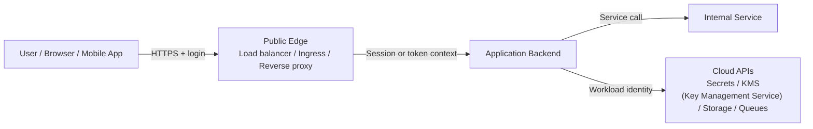
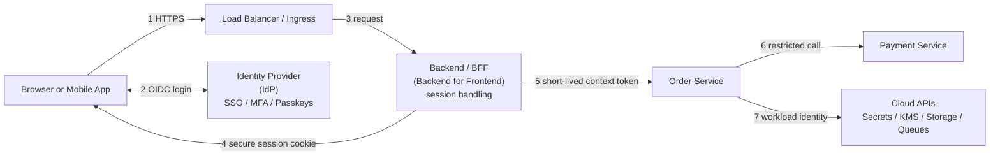
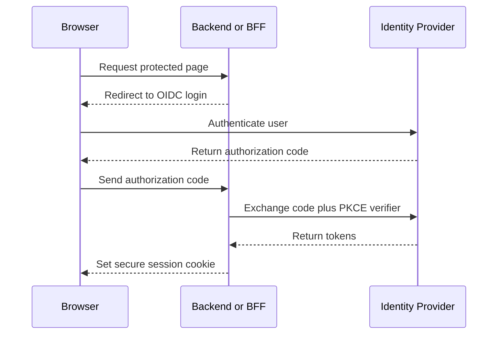
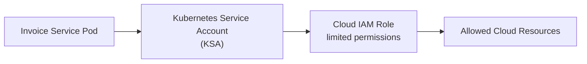
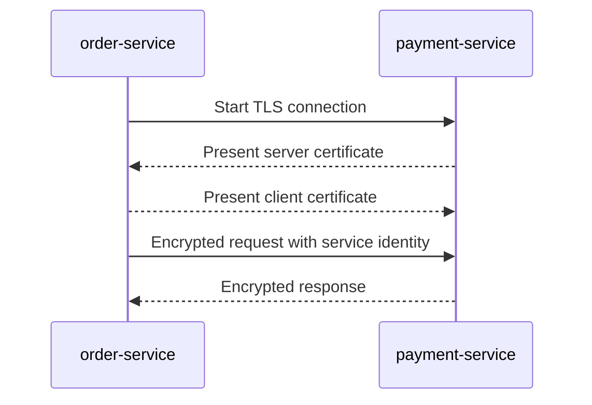
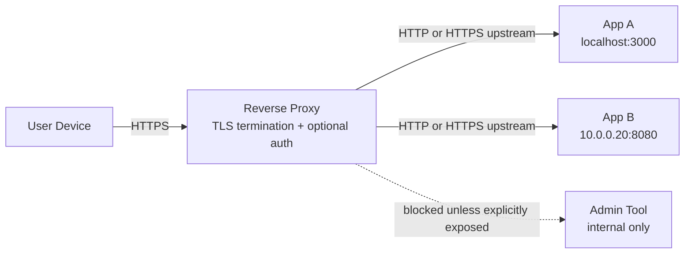
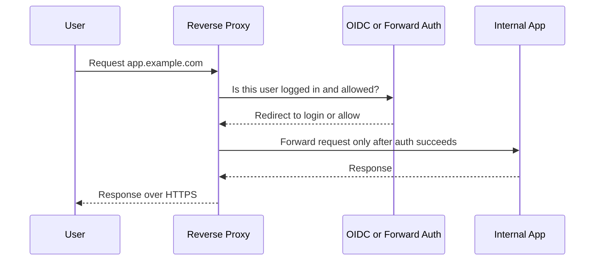
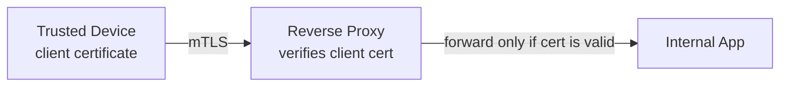
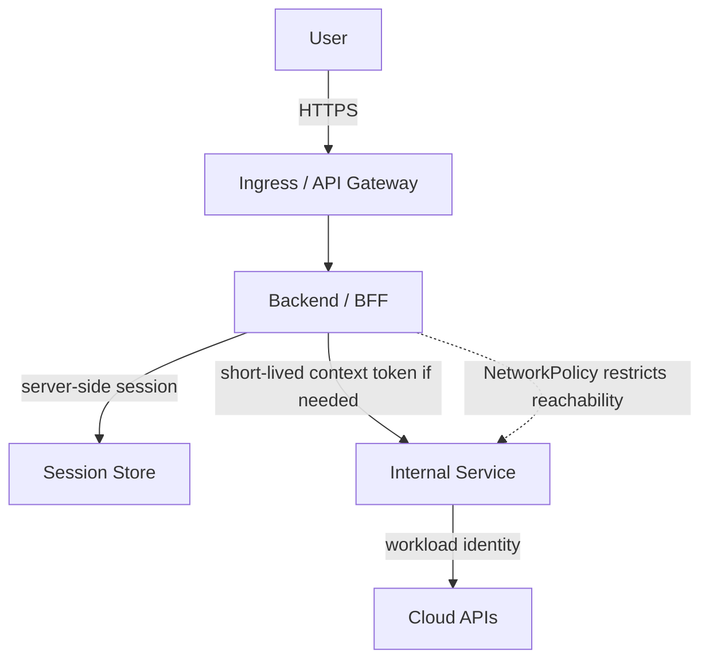
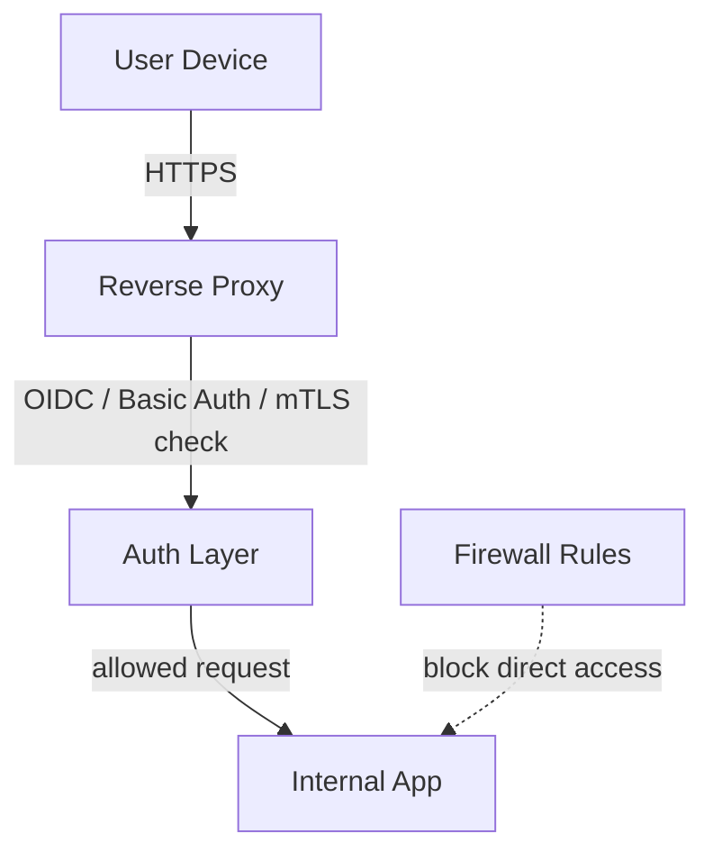

Authentication answers **who is calling**. Encryption answers **who can read or modify the traffic**. Authorization answers **what the caller is allowed to do**.

> Note: HTML comments such as `<!-- JSON Web Token -->` are source-level full-name annotations. They stay unobtrusive in rendered Markdown while making the first prose appearance of each abbreviation explicit. Code blocks and diagrams are usually expanded in nearby text instead of placing hidden comments inside code fences.

A useful way to understand auth <!-- authentication --> history is to follow the shape of the secret. Early systems reused human passwords. Web apps <!-- web applications --> then moved to server-side sessions. APIs <!-- Application Programming Interfaces --> introduced long-lived keys. Distributed systems introduced signed tokens. Cloud platforms introduced workload identity. Modern systems increasingly prefer short-lived, scoped, audience-bound, and sometimes sender-constrained credentials.

```text
passwords
  -> server-side sessions
  -> Basic Auth <!-- HTTP Basic Authentication --> and API keys
  -> signed tokens
  -> OAuth and OIDC
  -> MFA and passkeys
  -> mTLS and workload identity
  -> token exchange and sender-constrained tokens
```

The same trend appears again and again:

```text
long-lived shared secrets
  -> short-lived credentials
  -> scoped credentials
  -> asymmetric verification
  -> workload-bound or device-bound credentials
```

The practical question is always:

```text
If this secret leaks, what can the attacker do,
for how long,
against which systems,
and how quickly can we revoke or rotate it?
```


<details>
<summary>terms details click to expand</summary>

- **auth** — short for authentication: proving who or what is calling.
- **web app** — web application: software delivered through a browser or web protocol.
- **API** — Application Programming Interface: a contract that lets software call other software.
- **OAuth 2.0** — an authorization framework for delegated access; see [RFC 6749](https://datatracker.ietf.org/doc/html/rfc6749).
- **OIDC** — OpenID Connect: a login identity layer built on OAuth 2.0; see the [OpenID Connect Core specification](https://openid.net/specs/openid-connect-core-1_0.html).
- **MFA** — Multi-Factor Authentication: combining factors such as something you know, have, or are.
- **mTLS** — mutual Transport Layer Security: TLS where both client and server present certificates; see [TLS 1.3, RFC 8446](https://datatracker.ietf.org/doc/html/rfc8446) and OAuth certificate-bound token usage in [RFC 8705](https://datatracker.ietf.org/doc/html/rfc8705).
- **sender-constrained credential** — a credential bound to a certificate or private key so a stolen token alone is less useful; related standards include [OAuth mTLS, RFC 8705](https://datatracker.ietf.org/doc/html/rfc8705) and [DPoP, RFC 9449](https://datatracker.ietf.org/doc/html/rfc9449).

</details>

---

## 1. A brief story of how auth methods evolved

### 1.1 Passwords: the first simple proof

The earliest web authentication model was direct password login.

```text
user enters username + password
server verifies password
server decides whether login succeeds
```

This solved the first problem: **how does a human prove identity to a server?**

But passwords have obvious weaknesses. Users reuse them, attackers phish them, databases leak, and fast hardware can guess weak passwords at scale. Modern systems therefore store password verifiers, not plaintext passwords.

```text
salt = random()
stored_verifier = PasswordHash(password, salt, cost)
```

What remained: the browser still needed to prove the user was logged in on every later request without resending the password.

<details>
<summary>terms details click to expand</summary>

- **PasswordHash** — a placeholder for a password-hashing or password-based key-derivation algorithm. Prefer memory-hard or deliberately expensive schemes such as [Argon2id, RFC 9106](https://datatracker.ietf.org/doc/rfc9106/), bcrypt from the paper [A Future-Adaptable Password Scheme](https://www.usenix.org/legacy/event/usenix99/provos/provos.pdf), or PBKDF2 where policy requires it.
- **salt** — a random per-password value stored with the verifier. It prevents one precomputed table from attacking many users at once.
- **cost** — a tunable work factor. It does not make weak passwords mathematically impossible to guess; it makes each guess more expensive, which is why NIST recommends salted, costly password hashing for stored passwords.
- **Why hashes are not “reversed”** — a cryptographic hash maps input to a fixed-size digest. For an ideal 256-bit hash, a generic preimage search needs about `2^256` tries, while collision search has about `2^128` generic work by the birthday bound; see the [birthday attack explanation](https://en.wikipedia.org/wiki/Birthday_attack). For real algorithms such as SHA-256, there is no unconditional mathematical proof of one-wayness; security is based on public cryptanalysis and computational-hardness assumptions, the usual model explained in texts such as [Katz and Lindell, *Introduction to Modern Cryptography*](https://www.taylorfrancis.com/books/mono/10.1201/9781351133036/introduction-modern-cryptography-jonathan-katz-yehuda-lindell).

</details>

---

### 1.2 Sessions: stop sending the password

Sessions appeared to solve that problem.

```text
login succeeds
server creates session_id
browser stores session_id in a cookie
later requests include the cookie
```

The secret changed from a human password to a random session identifier.

```text
session_id = random_high_entropy_value
session_store[session_id] = user_id + expiry + security state
```

This remains a strong default for ordinary browser apps because the server can revoke the session, expire it, rotate it, and keep sensitive tokens away from browser JavaScript.

What remained: machine clients and scripts needed simple access too, and cookies were not always convenient for APIs.

---

### 1.3 Basic Auth and API keys: simple machine access

HTTP <!-- Hypertext Transfer Protocol --> Basic Auth made programmatic access easy.

```text
Authorization: Basic base64(username:password)
```

It solved convenience, but not credential safety. A long-lived secret is sent on every request. Base64 is encoding, not encryption, so Basic Auth must only be used over HTTPS <!-- Hypertext Transfer Protocol Secure -->.

API keys improved the shape slightly by replacing human passwords with random machine credentials.

```text
api_key = random_high_entropy_value
Authorization: Bearer api_key
```

This solved a real integration problem: external systems needed a stable credential for calling an API.

What remained: API keys are usually bearer secrets. Whoever has the key can use it. They need scoping, hashing at rest, rate limits, monitoring, and rotation.

<details>
<summary>terms details click to expand</summary>

- **HTTP** — Hypertext Transfer Protocol: the application protocol used by browsers and many APIs.
- **HTTPS** — HTTP over TLS. TLS encrypts the channel and authenticates the server certificate; see [TLS 1.3, RFC 8446](https://datatracker.ietf.org/doc/html/rfc8446).
- **Basic Auth** — HTTP Basic Authentication. The credential is `base64(username:password)`, which is encoding, not encryption; see the general HTTP authentication framework in [RFC 9110](https://datatracker.ietf.org/doc/html/rfc9110#section-11.6.1).
- **Base64** — a binary-to-text encoding, not a secrecy mechanism. Anyone can decode it.
- **API key** — a random machine credential, usually a bearer secret. Treat it like a password unless it is cryptographically bound to a sender.

</details>

---

### 1.4 Signed tokens: distributed validation

As web apps became distributed, every API call could not always depend on a central session database lookup. Signed tokens solved this by carrying claims that services can verify locally.

A JWT <!-- JSON Web Token --> has this general shape:

```text
base64url(header).base64url(payload).base64url(signature)
```

Typical claims include:

```json
{
  "iss": "issuer",
  "sub": "subject",
  "aud": "intended audience",
  "exp": "expiration time",
  "scope": "permissions"
}
```

This solved the problem of **portable request context**. A service can verify the signature, expiry, issuer, and audience without asking the login system on every request.

What remained: bearer tokens can still be stolen and replayed. Services must validate `aud`, `iss`, `exp`, signature, and scope. A token meant for `account-service` should not be accepted by `payment-service`.

The signing model also matters.

```text
Symmetric token signing:
  one shared secret signs and verifies
  every verifier could also forge tokens

Asymmetric token signing:
  issuer signs with private key
  services verify with public key
  verifiers cannot mint tokens
```

For multiple services, asymmetric signing is usually safer and easier to scale.

<details>
<summary>terms details click to expand</summary>

- **JWT** — JSON Web Token: a compact claims format that can be signed or MAC-protected; see [RFC 7519](https://datatracker.ietf.org/doc/html/rfc7519).
- **JWS / JWE / JWK / JWA** — JSON Web Signature, JSON Web Encryption, JSON Web Key, and JSON Web Algorithms. JWTs commonly rely on JWS for signatures; algorithm identifiers such as `HS256` and `RS256` are defined in [JWA, RFC 7518](https://datatracker.ietf.org/doc/html/rfc7518).
- **iss / sub / aud / exp** — issuer, subject, audience, and expiration time. These are compact claim names, not encryption.
- **base64url** — a URL-safe Base64 variant used to serialize JWT header and payload; it is not encryption.
- **HS256** — HMAC using SHA-256. HMAC combines a secret key with a cryptographic hash so only parties with the shared key can produce the same MAC. Read the standard in [HMAC, RFC 2104](https://datatracker.ietf.org/doc/html/rfc2104), the original proof-oriented paper [Bellare, Canetti, and Krawczyk, *Keying Hash Functions for Message Authentication*](https://cseweb.ucsd.edu/~mihir/papers/kmd5.pdf), and the SHA-256 family definition in [FIPS 180-4](https://csrc.nist.gov/pubs/fips/180-4/upd1/final).
- **RS256** — RSA signature using SHA-256 with RSASSA-PKCS1-v1_5. The verifier checks a public-key signature; only the private-key holder should be able to create it. See [JWA, RFC 7518](https://datatracker.ietf.org/doc/html/rfc7518), [PKCS #1, RFC 8017](https://datatracker.ietf.org/doc/html/rfc8017), and the original RSA paper [Rivest, Shamir, and Adleman, 1978](https://people.csail.mit.edu/rivest/Rsapaper.pdf).
- **Why HS256/RS256 are not solvable in reasonable time** — the honest version is “not known to be solvable with feasible resources,” not “mathematically proven impossible.” For an ideal 256-bit hash/MAC output, brute-force guessing has about `2^256` possibilities; birthday collision attacks reach about `2^128` generic work. HMAC has formal security reductions to assumptions about the underlying hash/compression function. RSA signatures rely on the hardness of RSA-related problems and, in practice, large moduli; the hardness of factoring is an assumption, not an unconditional proof. This is the normal computational-security model used in modern cryptography.

</details>

---

### 1.5 OAuth <!-- OAuth 2.0 Authorization Framework; protocol name, not a strict acronym --> and OIDC <!-- OpenID Connect -->: delegated access and modern login

OAuth appeared because users should not give their password to every third-party application.

```text
OAuth 2.0 = delegated API access
OIDC      = user login identity layer on top of OAuth 2.0
```

OAuth answers questions such as:

```text
Can this app access this user's calendar with limited scope?
```

OIDC answers questions such as:

```text
Who is this user, according to the identity provider?
```

For modern browser and mobile login, the common baseline is:

```text
OIDC Authorization Code Flow with PKCE <!-- Proof Key for Code Exchange -->
```

PKCE protects public clients during the redirect flow. It helps prevent an intercepted authorization code from being used by an attacker.

What remained: login is not authorization. The application still has to check tenant, role, ownership, and business rules.

<details>
<summary>terms details click to expand</summary>

- **OAuth 2.0** — delegated authorization: a client gets limited access without receiving the user's password; see [RFC 6749](https://datatracker.ietf.org/doc/html/rfc6749).
- **OIDC** — OpenID Connect: adds an identity/login layer and ID tokens on top of OAuth 2.0; see [OpenID Connect Core](https://openid.net/specs/openid-connect-core-1_0.html).
- **Authorization Code Flow** — an OAuth/OIDC redirect flow where the client receives an authorization code and exchanges it for tokens through the token endpoint.
- **PKCE** — Proof Key for Code Exchange: a mitigation for authorization-code interception; the common `S256` method hashes the code verifier with SHA-256. See [RFC 7636](https://datatracker.ietf.org/doc/html/rfc7636).
- **IdP** — Identity Provider: the system that authenticates the user and issues identity-related tokens or assertions.

</details>

---

### 1.6 MFA <!-- Multi-Factor Authentication --> and passkeys: stronger human proof

Passwords alone are too easy to phish or reuse, so systems added MFA.

```text
password + second factor
```

TOTP <!-- Time-based One-Time Password --> codes improved password-only login, but users can still be tricked into typing codes into phishing sites.

Passkeys and WebAuthn <!-- Web Authentication --> move the secret into a public-key credential scoped to the website origin.

```text
registration:
  authenticator creates private_key + public_key
  server stores public_key

login:
  server sends challenge
  authenticator signs challenge for this origin
  server verifies signature with public_key
```

This improved the shape of the secret. The server stores a public key, not a reusable shared secret. The private key does not need to leave the device or authenticator.

What remained: account recovery, device loss, shared devices, enterprise policy, and fallback methods still need careful design.

<details>
<summary>terms details click to expand</summary>

- **MFA** — Multi-Factor Authentication: authentication using multiple independent factors.
- **TOTP** — Time-based One-Time Password: a time-windowed code derived from a shared secret and HMAC; see [RFC 6238](https://datatracker.ietf.org/doc/html/rfc6238).
- **Passkey** — a user-friendly name for a WebAuthn/FIDO-style public-key credential.
- **WebAuthn** — Web Authentication: a W3C API for creating and using origin-scoped public-key credentials; see the [W3C WebAuthn specification](https://www.w3.org/TR/webauthn-2/).
- **Challenge signing** — the server sends unpredictable data, and the authenticator signs it with a private key. Verification uses the stored public key, so the server does not need a reusable shared secret for that credential.

</details>

---

### 1.7 mTLS <!-- mutual Transport Layer Security --> and workload identity: service identity

Microservices introduced a second identity problem. It is not enough to know which user initiated an action. A service also needs to know which workload is calling.

mTLS solves this at the connection layer.

```text
client proves identity with a certificate
server proves identity with a certificate
traffic is encrypted between them
```

Workload identity solves a related cloud problem: a workload needs cloud permissions without static cloud keys in environment variables or files.

```text
pod or service account
  -> platform-issued short-lived credential
  -> cloud IAM <!-- Identity and Access Management --> role
  -> allowed cloud APIs
```

What remained: service identity is not business authorization. If `order-service` calls `payment-service`, `payment-service` still needs to decide whether the requested payment is valid for the user, tenant, order, and business state.

<details>
<summary>terms details click to expand</summary>

- **mTLS** — mutual TLS: both sides authenticate certificates during a TLS handshake, giving cryptographic service or device identity in addition to encryption. See [TLS 1.3, RFC 8446](https://datatracker.ietf.org/doc/html/rfc8446).
- **certificate** — a signed statement binding a public key to a name or identity. A certificate does not by itself grant business permission; it is an identity proof.
- **IAM** — Identity and Access Management: policies and roles controlling access to cloud resources.
- **workload identity** — a platform-issued identity for code running as a pod, service, job, function, or VM. The goal is to replace static keys with short-lived, scoped credentials.

</details>

---

### 1.8 Token exchange and sender-constrained tokens: reducing replay and blast radius

Plain bearer tokens have a simple weakness: whoever holds the token can use it.

More advanced mechanisms reduce that risk.

```text
Token exchange:
  broad upstream token
    -> narrower downstream token
       with specific audience and scope

Sender-constrained token:
  token is bound to a client key or certificate
  stolen token alone is not enough
```

These methods appeared because distributed systems needed more than “pass the same powerful token everywhere.”

What remained: they add infrastructure and policy complexity, so they are most useful in larger or more sensitive systems.

<details>
<summary>terms details click to expand</summary>

- **bearer token** — a token usable by whoever possesses it; see [OAuth Bearer Token Usage, RFC 6750](https://datatracker.ietf.org/doc/html/rfc6750).
- **token exchange** — exchanging one token for another with a narrower audience, scope, or subject context; see [OAuth 2.0 Token Exchange, RFC 8693](https://datatracker.ietf.org/doc/html/rfc8693).
- **sender-constrained token** — a token bound to a certificate or public key. A stolen token alone is insufficient unless the attacker also has the matching private key; see [OAuth mTLS, RFC 8705](https://datatracker.ietf.org/doc/html/rfc8705) and [DPoP, RFC 9449](https://datatracker.ietf.org/doc/html/rfc9449).

</details>

---

## 2. Map methods to connections, not trends

Most confusion comes from treating authentication as one big problem. It is clearer to split the system into connections.



Each connection needs a different answer.

| Connection                 | Main question                                 | Typical methods                                      | What still remains                     |
| -------------------------- | --------------------------------------------- | ---------------------------------------------------- | -------------------------------------- |
| User to public edge        | Is traffic private and is this the real site? | HTTPS/TLS <!-- Transport Layer Security -->                                            | User is not logged in yet              |
| User to app                | Who is the human user?                        | OIDC, SSO <!-- Single Sign-On -->, session cookie, short-lived token         | Authorization still checks permissions |
| Browser credential storage | Where should credentials live?                | HttpOnly session cookie or short-lived token storage | Browser-side abuse is still possible   |
| Service to service         | Which workload is calling?                    | mTLS, signed JWT, service mesh identity              | Business authorization still required  |
| Service to cloud APIs      | Which workload may access cloud resources?    | Workload identity, least-privilege IAM               | Overbroad roles still cause damage     |
| Internal reachability      | Can this caller even reach that service?      | NetworkPolicy, firewall, security groups             | Reachability is not proof of identity  |

<details>
<summary>terms details click to expand</summary>

- **TLS** — Transport Layer Security: the protocol family behind HTTPS encryption and server authentication; see [RFC 8446](https://datatracker.ietf.org/doc/html/rfc8446).
- **SSO** — Single Sign-On: a user signs in through a central identity system and uses that authentication across multiple applications.
- **KMS** — Key Management Service: a managed system for storing, using, rotating, and auditing cryptographic keys.
- **NetworkPolicy** — in Kubernetes, a policy object for limiting which pods can connect to which other pods or network endpoints.
- **firewall / security group** — network-level reachability control. It is useful isolation, but it is not the same as cryptographic identity or application authorization.

</details>

---

## 3. Cloud-hosted web app: recommended flow

A cloud-hosted web app usually has three auth and encryption areas:

1. **User to edge**: protect the public connection with HTTPS.
2. **User to backend**: authenticate the human user with OIDC and keep browser credentials safe.
3. **Backend to backend or cloud**: authenticate workloads and limit blast radius.



### 3.1 HTTPS at the public edge

**Problem it fixes:** users need to know they are talking to the real application, and attackers on the network should not read or modify traffic.

Use HTTPS from the browser or mobile app to the public edge: load balancer, ingress, API gateway, or reverse proxy.

What remains:

* HTTPS does not log the user in.
* HTTPS does not decide whether a user can access an order, invoice, admin page, or tenant.
* If TLS terminates at the edge, traffic behind the edge needs a separate decision: internal HTTP, internal HTTPS, or mTLS.

---

### 3.2 OIDC + PKCE for human login

**Problem it fixes:** the application needs to know which human user is signing in without building its own password system.

For most modern web apps, use:

```text
OIDC Authorization Code Flow with PKCE
```



What remains:

* OIDC proves the user logged in; it does not authorize every action.
* The app still needs tenant checks, role checks, resource ownership checks, and business rules.
* The app still needs safe session handling after login.

---

### 3.3 Backend-managed session for browser apps

**Problem it fixes:** browser JavaScript is a risky place to store powerful credentials.

For first-party browser apps, a strong default is:

```text
OIDC + PKCE login
+ backend-managed session
+ HttpOnly Secure SameSite cookie
```

The browser receives an opaque session cookie. The backend stores sensitive state such as refresh tokens, session data, and user-to-permission mapping.

What remains:

* A malicious script may still send requests from the user’s active browser session.
* Sensitive actions still need authorization checks, CSRF <!-- Cross-Site Request Forgery --> protection where applicable, and sometimes step-up authentication.
* Session revocation, timeout, device management, and audit logging still matter.

The point is not that cookies are magic. The point is that long-lived bearer tokens in browser-accessible storage are usually a worse default for first-party browser apps.

<details>
<summary>terms details click to expand</summary>

- **BFF** — Backend for Frontend: a backend tailored to one UI/client type. It can keep refresh tokens and sensitive session state away from browser JavaScript.
- **HttpOnly** — a cookie flag that prevents browser JavaScript from reading the cookie value.
- **Secure** — a cookie flag requiring the cookie to be sent only over HTTPS.
- **SameSite** — a cookie attribute that limits when cookies are sent on cross-site requests.
- **CSRF** — Cross-Site Request Forgery: an attack where another site causes the user's browser to send an authenticated request. SameSite cookies and explicit CSRF tokens are common mitigations.

</details>

---

### 3.4 JWT access tokens for API request context

**Problem it fixes:** backend services sometimes need to validate request context without calling a central session store on every request.

JWTs are useful when:

* an API gateway passes user context to backend services
* services need local validation of request context
* multiple APIs need a consistent, signed representation of identity
* mobile apps call APIs directly with short-lived access tokens

What remains:

* A JWT is still a bearer credential until it expires.
* Services must validate issuer, expiry, signature, and audience.
* JWTs do not remove the need for application authorization.

---

### 3.5 Workload identity for pod-to-cloud access

**Problem it fixes:** backend workloads need cloud permissions without storing long-lived cloud keys in containers.

Examples include AWS <!-- Amazon Web Services --> EKS <!-- Elastic Kubernetes Service --> Pod Identity or IRSA <!-- IAM Roles for Service Accounts -->, GKE <!-- Google Kubernetes Engine --> Workload Identity, and Microsoft Entra Workload ID for AKS <!-- Azure Kubernetes Service -->.



What remains:

* Workload identity authenticates a workload to cloud APIs, not automatically to other services.
* If every pod maps to the same powerful role, isolation is still poor.
* Least-privilege IAM, secret scoping, and audit logging are still required.

<details>
<summary>terms details click to expand</summary>

- **AWS** — Amazon Web Services.
- **EKS** — Elastic Kubernetes Service. AWS documents [EKS Pod Identity](https://docs.aws.amazon.com/eks/latest/userguide/pod-identities.html) and [IAM Roles for Service Accounts](https://docs.aws.amazon.com/eks/latest/userguide/iam-roles-for-service-accounts.html) as ways to grant pods AWS permissions.
- **IRSA** — IAM Roles for Service Accounts: an AWS EKS mechanism that maps Kubernetes service accounts to AWS IAM roles.
- **GKE** — Google Kubernetes Engine. Google documents [Workload Identity Federation for GKE](https://docs.cloud.google.com/kubernetes-engine/docs/concepts/workload-identity) for letting GKE workloads access Google Cloud services.
- **AKS** — Azure Kubernetes Service. Microsoft documents [Microsoft Entra Workload ID for AKS](https://learn.microsoft.com/en-us/azure/aks/workload-identity-overview) for pod-to-Azure identity.
- **KSA** — Kubernetes Service Account: an in-cluster identity object commonly used as the local side of workload-identity mapping.

</details>

---

### 3.6 NetworkPolicy and mTLS for pod-to-pod traffic

Pod-to-pod communication has two different problems.

**Problem A: Can this workload reach that workload?**

Use NetworkPolicy, firewall rules, security groups, or service mesh traffic policy to limit reachability.

```text
Only order-service can call payment-service.
A random image worker cannot call payment-service.
```

What remains:

* NetworkPolicy does not prove cryptographic identity.
* NetworkPolicy does not decide whether the requested payment action is valid.

**Problem B: Can this service prove its identity over the connection?**

Use mTLS when you need cryptographic service identity or encrypted internal traffic.



What remains:

* mTLS proves service identity, not user permission.
* If a service is compromised, it may still use its valid certificate until isolated or rotated.
* mTLS needs certificate automation, rotation, debugging support, and operational ownership.

---

## 4. Local reverse proxy: recommended flow

A local reverse proxy is often the single entry point to several internal applications.

Examples:

* `app.example.com` forwards to an app on `localhost:3000`
* `git.example.com` forwards to an internal Git server
* `grafana.example.com` forwards to a monitoring dashboard
* a home lab or office network exposes apps through Nginx, Caddy, Traefik, Apache, or HAProxy



The local reverse proxy needs answers for three questions:

1. **How is traffic encrypted from the user to the proxy?**
2. **Who is allowed through the proxy?**
3. **Should traffic from the proxy to the upstream app also be encrypted or authenticated?**

---

### 4.1 HTTPS from user to reverse proxy

**Problem it fixes:** users need private traffic to the proxy, and browsers need to verify the site identity.

Use HTTPS on the reverse proxy. Public domains commonly use certificates from a public CA <!-- Certificate Authority -->. Private domains may use an internal CA or DNS <!-- Domain Name System --> challenge-based certificates.

What remains:

* HTTPS to the proxy does not authenticate the user by itself.
* If the proxy forwards to an upstream app over HTTP, traffic is encrypted only up to the proxy.
* If the upstream app trusts every request from the proxy, a proxy misconfiguration can become serious.

For a single machine where the proxy forwards to `localhost`, HTTP upstream may be acceptable. For traffic across a LAN <!-- Local Area Network -->, between VMs <!-- Virtual Machines -->, or across untrusted networks, prefer HTTPS or mTLS upstream.

<details>
<summary>terms details click to expand</summary>

- **CA** — Certificate Authority: an entity that issues certificates trusted by clients or by your private infrastructure.
- **DNS** — Domain Name System: maps names such as `app.example.com` to network addresses and is also used for some certificate-validation flows.
- **LAN** — Local Area Network: a private local network segment.
- **VM** — Virtual Machine: a virtualized server instance. Traffic between VMs can cross virtual switches and network policy layers, so upstream encryption may matter more than on `localhost`.

</details>

---

### 4.2 Proxy-level login with OIDC or forward auth

**Problem it fixes:** many local apps have weak, inconsistent, or no built-in authentication. A reverse proxy can enforce one login layer before requests reach those apps.



What remains:

* The upstream app may still need its own authorization for sensitive actions.
* The proxy must correctly pass identity headers and prevent clients from spoofing them.
* The upstream app should only accept trusted identity headers from the proxy.
* If the proxy is bypassed, proxy authentication is bypassed too. Firewall rules should block direct access to upstream apps.

---

### 4.3 Basic authentication for simple protection

**Problem it fixes:** a small internal or low-risk endpoint needs a quick username/password gate.

HTTP Basic Authentication can be acceptable for low-risk internal tools when combined with HTTPS.

What remains:

* Basic Auth is not a full identity platform.
* Password sharing and rotation become operational problems.
* There is usually no MFA, SSO, device management, or central audit trail.
* It is a poor fit for high-risk internet-facing admin tools.

---

### 4.4 Client certificates and mTLS for trusted devices or admin access

**Problem it fixes:** the proxy or upstream app needs to verify that the client is a trusted device, automation job, or administrator machine before accepting traffic.



What remains:

* Certificate issuance, storage, revocation, and rotation must be managed.
* Losing a trusted client certificate is similar to losing a powerful credential.
* mTLS identifies the client certificate, but the app may still need user or role authorization.

---

### 4.5 Upstream encryption: proxy to app

**Problem it fixes:** traffic behind the reverse proxy may cross a network you do not fully trust.

| Upstream path                              | Reasonable default       | Why                                                |
| ------------------------------------------ | ------------------------ | -------------------------------------------------- |
| Proxy to app on same host via `localhost`  | HTTP is often acceptable | Traffic does not leave the host network stack      |
| Proxy to app on private LAN or separate VM | HTTPS is safer           | Other hosts or network devices may observe traffic |
| Proxy to sensitive upstream service        | mTLS is stronger         | Both proxy and upstream prove identity             |

What remains:

* Encrypting upstream traffic does not replace upstream authorization.
* The upstream app should still reject direct untrusted access.
* If the proxy passes identity headers, the upstream app must trust only the proxy path.

---

## 5. Method-by-method guide

| Method                   | Problem it fixes                                                    | Best fit                                                            | Issues that remain                                                    |
| ------------------------ | ------------------------------------------------------------------- | ------------------------------------------------------------------- | --------------------------------------------------------------------- |
| Password                 | Human proves identity directly                                      | Initial login when no IdP exists                                    | Phishing, reuse, guessing, recovery burden                            |
| Session cookie           | Avoid resending passwords; keep browser state server-side           | First-party browser apps                                            | Active session abuse, CSRF, session lifecycle                         |
| HTTPS/TLS                | Encrypts traffic and authenticates the server                       | Browser to public site, browser to reverse proxy, proxy to upstream | Does not log in users or authorize actions                            |
| Basic Auth               | Simple password gate                                                | Low-risk internal tools                                             | Weak lifecycle, limited audit, no modern SSO/MFA by default           |
| API key                  | Simple programmatic access                                          | Legacy integrations or simple external clients                      | Long-lived bearer secret; rotation and scoping are hard               |
| OIDC + PKCE              | Authenticates human users through an identity provider              | Cloud web apps, SSO, proxy login                                    | App still needs authorization and session handling                    |
| JWT access token         | Carries signed request context                                      | APIs, service calls, mobile clients                                 | Must validate expiry, issuer, audience, and scope                     |
| Token exchange           | Narrows a token for the next service hop                            | Large or sensitive service graphs                                   | More infrastructure and policy complexity                             |
| Workload identity        | Gives workloads cloud permissions without static keys               | Kubernetes pod to cloud APIs                                        | Does not authenticate pod-to-pod traffic; IAM must be least privilege |
| NetworkPolicy / firewall | Limits which systems can reach each other                           | Kubernetes, local networks, reverse proxy upstreams                 | Reachability is not authentication or authorization                   |
| mTLS                     | Encrypts traffic and authenticates both sides                       | Service-to-service, proxy-to-upstream, trusted devices              | Certificate lifecycle and operational complexity                      |
| HMAC <!-- Hash-based Message Authentication Code --> signing             | Verifies message integrity and sender possession of a shared secret | Webhooks                                                            | Requires replay protection and shared secret management               |
| Passkeys / WebAuthn      | Strong phishing-resistant human authentication                      | High-value user accounts, modern login                              | Recovery and device lifecycle still matter                            |

<details>
<summary>terms details click to expand</summary>

- **HMAC** — Hash-based Message Authentication Code. It proves message integrity and possession of a shared secret without encrypting the message; see [RFC 2104](https://datatracker.ietf.org/doc/html/rfc2104) and the proof-oriented paper [Bellare, Canetti, and Krawczyk](https://cseweb.ucsd.edu/~mihir/papers/kmd5.pdf).
- **MAC** — Message Authentication Code: a keyed integrity/authenticity tag.
- **Webhook signing** — commonly uses HMAC over the request body plus timestamp or nonce. The timestamp/nonce matters because HMAC alone does not stop replay of an old valid message.

</details>

---

## 6. Practical recommendations

### For a cloud-hosted web app



Use this default shape:

1. Use HTTPS at the public edge.
2. Use OIDC Authorization Code Flow with PKCE for user login.
3. Prefer backend-managed sessions with `HttpOnly`, `Secure`, `SameSite` cookies for first-party browser apps.
4. Use short-lived JWTs only when APIs or services need signed request context.
5. Validate audience, issuer, expiry, and signature on tokens.
6. Use workload identity for pod-to-cloud access.
7. Use least-privilege IAM per service account.
8. Use NetworkPolicy or equivalent controls to reduce lateral movement.
9. Add mTLS when service identity or internal encryption is worth the operational cost.
10. Keep authorization close to the protected resource.

### For a local reverse proxy



Use this default shape:

1. Always use HTTPS from users to the reverse proxy.
2. Use proxy-level OIDC or forward auth for apps that lack strong built-in login.
3. Use Basic Auth only for simple, low-risk cases.
4. Use client certificates or mTLS for trusted devices, machine access, or admin-only endpoints.
5. Block direct access to upstream apps so users cannot bypass the proxy.
6. Use HTTPS or mTLS from proxy to upstream when traffic crosses a network or reaches sensitive services.
7. Be careful with identity headers; upstream apps should trust them only from the proxy.
8. Keep app-level authorization for sensitive operations.

---

## Final conclusion

Auth methods evolved because each generation fixed a specific weakness in the previous one.

Passwords proved human identity, but were weak and reused. Sessions avoided sending passwords repeatedly. API keys made machine access easy, but created long-lived bearer secrets. Signed tokens allowed distributed validation, but introduced replay and audience risks. OAuth and OIDC separated delegated access from login. MFA and passkeys strengthened human authentication. mTLS and workload identity gave services better identities. Token exchange and sender-constrained tokens reduced blast radius in larger distributed systems.

For cloud web apps, use HTTPS, OIDC + PKCE, backend-managed sessions, short-lived tokens where needed, workload identity, NetworkPolicy, and mTLS only when service identity or internal encryption justifies the complexity.

For local reverse proxies, use HTTPS at the front door, proxy-level authentication when apps lack strong login, firewall rules to prevent bypass, and upstream HTTPS or mTLS when the backend hop crosses a network or carries sensitive traffic.

A good architecture does not ask, “Which auth method is fashionable?” It asks:

```text
What secret proves identity here?
Where is it stored?
How is it transmitted?
Who validates it?
What can it access?
How fast can it expire, rotate, or be revoked?
```

That is the story of authentication evolution: make secrets harder to steal, narrower when stolen, shorter-lived by default, and easier to revoke.
